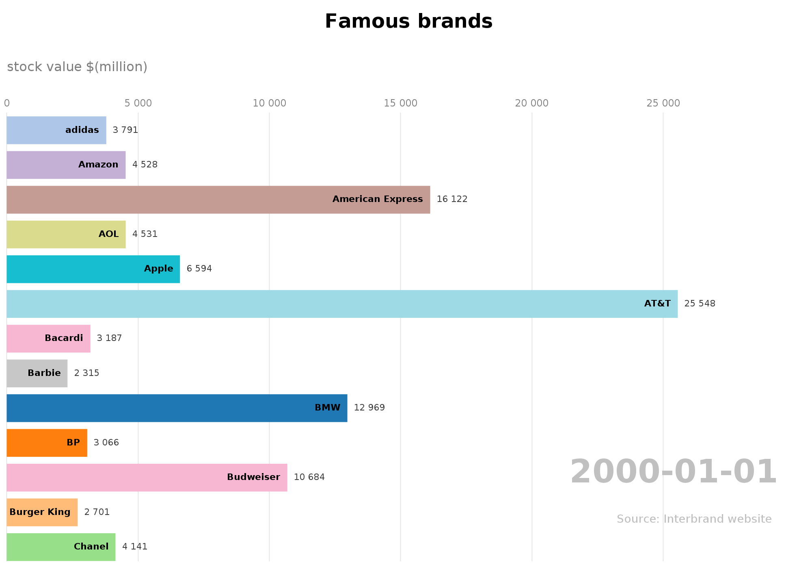

<p align="center">
  <h3 align="center">Diagrammes animés</h3>

  <p align="center">Programmes qui génèrent des diagrammes en barres animés à la Flourish. Les graphiques ont été réalisés à l’aide de la bibliothèque StdDraw.
    <br /><br />
    <a href="#installation"><b>INSTALLATION INSTRUCTIONS</b></a>
  </p>
</p>

<!-- TABLE OF CONTENTS -->
## Table des matières
* [Exemple](##exemple)
* [À propos du projet](#à-propos-du-projet)
* [Installation](#installation)
* [Conditions préalables](#condition-préalable)
* [Contact](#contact)

## Exemple
<p>Voici un exemple d'un diagramme non animé: </p>
<p align="center">
  
</p>

## À propos du projet
<p>Programmes qui génèrent des diagrammes en barres animés à la Flourish. Les graphiques ont été réalisés à l’aide de la bibliothèque StdDraw. Ce projet a été réalisé par Julien ERHARD pour le défi S1 en 2020 en DUT informatique de Belfort</p>

Ce projet contient ces programmes java :
<p>| <a href="src/diagram/model/DiagBar.java">DiagBar.java</a> | <a href="src/diagram/model/Bar.java">Bar.java</a> | <a href="AnimatedDiagBar.java">AnimatedDiagBar.java</a> | <a href="src/diagram/model/PreprocessData.java">PreprocessData.java</a> |</p>

Ce projet contient ces exemples :
<p>| <a href="src/diagram/model/Diagramme.png">Diagramme.png</a> | <a href="src/diagram/model/Diagramme_animé.mp4">Diagramme_animé.mp4</a> | <a href="src/diagram/model/Exemple.txt">Exemple.txt</a> |</p>

Ce projet contient cette bibliothèque java:
<p>| <a href="src/diagram/model/StdDraw.java">StdDraw.java</a> |</p>


## Installation
Télécharger le projet Diagram, puis compiler le programme java AnimatedDiagBar.java:
  ```
  javac AnimatedDiagBar.java
  ```
  Et pour finir tester le programme avec l'exemple fourni:
  ```
  java AnimatedDiagBar exemple.txt 13 nosort
  ```
<p>Pour comprendre l'utilité de chaques programmes et pour pouvoir créer des diagrammes animés veuillez lire la documentation: <a href="src/diagram/model/README.txt">README.txt</a>
  
## Condition préalable
Pour faire fonctionner les programmes vous avez besoin d'installer java:
<ul><li><a href="https://www.java.com/fr/download/">Java</a></li></ul>

## Contact
En cas de problème ou autre, vous pouvez me contacter à l'adresse mail suivante: julien1.erhard@gmail.com.
